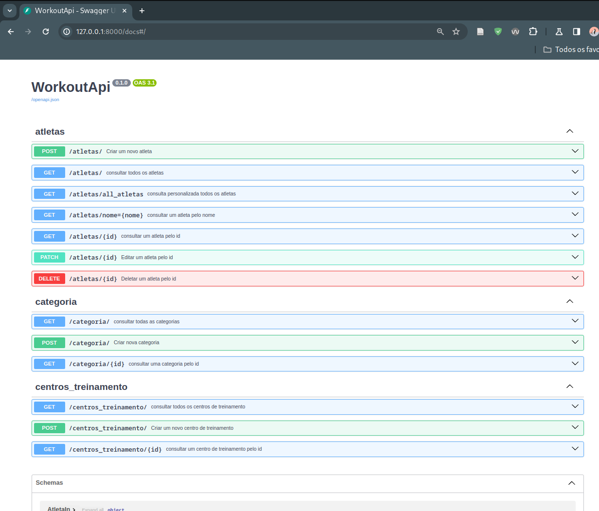

<div align="center">

<h1> Coding The Future Vivo <br> Python AI Backend Developer </h1>

</div>
 
 <h1 align="center"> Sistema Bancário em POO com Python </h1>

Este é um desafio de projeto do **Coding The Future Vivo - Python AI Backend Developer** 

Desafio: Desenvolvendo sua Primeira API com FastAPI, Python e Docker

**Funcionalidades** 🛠️

## Parte 1

Para criar uma API RESTful completa usando FastAPI, Python e Docker. FastAPI é um framework Python moderno e de alto desempenho para construir APIs. Docker é uma plataforma de contêiner que permite empacotar e distribuir aplicativos de forma independente.


## **Pré-requisitos**

- Python 3.0
- Docker instalado
- Editor de código


### **Criando o Projeto FastAPI**

1. Crie um novo diretório para seu projeto:

```plaintext
mkdir fastapi-docker
cd fastapi-docker
```

1. Crie um arquivo `main.py` com o seguinte conteúdo:

Python

```python
from fastapi import FastAPI

app = FastAPI()

@app.get("/")
async def root():
    return {"message": "Hello, World!"}
```


### **Criando o Dockerfile**

1. Crie um arquivo `Dockerfile` com o seguinte conteúdo:

```plaintext
FROM python:3.8-slim

WORKDIR /app

COPY requirements.txt .
RUN pip install --no-cache-dir -r requirements.txt

COPY . .

CMD ["uvicorn", "main:app", "--host", "0.0.0.0", "--port", "8000"]
```


### **Executando a API**

1. Crie um arquivo `requirements.txt` com as dependências do seu projeto:

```plaintext
fastapi
```

1. Construa a imagem do Docker:

```plaintext
docker build -t fastapi-docker .
```

1. Execute o contêiner:

```plaintext
docker run -p 8000:8000 fastapi-docker
```

### **Testando a API**

Você pode testar sua API enviando uma solicitação GET para a URL `http://localhost:8000`. Você deve receber a seguinte resposta:

json

```json
{"message": "Hello, World!"}
```


## **Conclusão**

Você criou com sucesso uma API RESTful usando FastAPI, Python e Docker. Este projeto abrangente fornece uma base sólida para o desenvolvimento de APIs mais complexas.


## Ou 

## Parte 2


Desenvolver uma API com FastAPI, Python e Docker é uma ótima maneira de criar serviços web escaláveis e fáceis de manter. Vou te dar uma visão geral dos passos envolvidos:


1. ### **Configuração do Ambiente:**

   - Instale o Python (se ainda não estiver instalado).

   - Instale o Docker Desktop (para gerenciar contêineres).

     

2. ### **Crie um Projeto:**

   - Crie uma pasta para o seu projeto.

   - Dentro dessa pasta, crie um arquivo chamado `main.py`.

     

3. ### **Instale o FastAPI:**

   - Abra o terminal e execute:

     ```
     pip install fastapi
     ```

     

4. ### **Escreva sua API:**

   - No arquivo `main.py`, importe o FastAPI:

     Python

     

     ```python
     from fastapi import FastAPI
     
     app = FastAPI()
     ```

     Código gerado por IA. Examine e use com cuidado. [Mais informações em perguntas frequentes](https://www.bing.com/new#faq).

   - Crie uma rota básica:

     Python

     

     ```python
     @app.get("/")
     def read_root():
         return {"message": "Olá, mundo!"}
     ```

     Código gerado por IA. Examine e use com cuidado. [Mais informações em perguntas frequentes](https://www.bing.com/new#faq).

5. ### **Execute a API:**

   - No terminal, vá para a pasta do seu projeto e execute:

     ```
     uvicorn main:app --reload
     ```

     

6. ### **Teste a API:**

   - Abra o navegador e acesse `http://localhost:8000`.
   - Você verá a mensagem “Olá, mundo!”.

   

7. ### **Dockerize a Aplicação:**

   - Crie um arquivo chamado `Dockerfile` na pasta do projeto.

   - Adicione o seguinte conteúdo ao `Dockerfile`:

     ```
     FROM tiangolo/uvicorn-gunicorn-fastapi:python3.8
     
     COPY ./app /app
     ```

     

   - No terminal, execute:

     ```
     docker build -t minha-api .
     ```

     

   - Execute a imagem em um contêiner:

     ```
     docker run -d --name minha-api-container -p 80:80 minha-api
     ```

     

8. ### **Teste a API no Docker:**

   - Acesse `http://localhost` no navegador.

Isso deve te dar um ponto de partida para desenvolver sua primeira API com FastAPI, Python e Docker. Lembre-se de consultar a documentação oficial do FastAPI para recursos avançados e personalizações! 🚀


# Regras de Montagem:

https://github.com/digitalinnovationone/workout_api 

Instruções:

- adicionar query parameters nos endpoints

      - atleta
            - nome
            - cpf

- customizar response de retorno de endpoints

      - get all
            - atleta
                  - nome
                  - centro_treinamento
                  - categoria

- Manipular exceção de integridade dos dados em cada módulo/tabela

      - sqlalchemy.exc.IntegrityError e devolver a seguinte mensagem: “Já existe um atleta cadastrado com o cpf: x”
      - status_code: 303

- Adicionar paginação utilizando a lib: fastapi-pagination

      - limit e offset


# Tecnologias Utilizadas

- pipenv - controle de versão
- PostgreSQL - banco de dados com docker-compose
- SQLAlchemy + Pydantic + Alembic - conexão com banco de dados
- FastAPI - desenvolver a aplicação


#  Solução do desafio

O código foi feita seguindo a aula da instrutora.

Para executar o código:

- Rodar banco de dados na pasta workout_api

```console
$ docker-compose up -d
```

- Rodar alembic na pasta do projeto (local do Makefile)

```console
$ make run-migrations
```

- Rodar app na pasta do projeto

```console
$ make run
```


## Adicionar query parameters nos endpoints

      - atleta
            - nome
            - cpf

Foi adicionado no arquivo atleta/controller.py. É necessário fornecer nome e cpf para a consulta.

```python
@router.get(
        path='/nome={nome}', 
        summary='consultar um atleta pelo nome',
        status_code = status.HTTP_200_OK,
        response_model= AtletaOut,
        ) 


async def query(nome: str, db_session: DatabaseDependency, cpf: str | None = None) -> AtletaOut:
    atleta: AtletaOut = (
    await db_session.execute(select(AtletaModel).filter_by(nome=nome, cpf=cpf))
        ).scalars().first()
     
    if not atleta:
        raise HTTPException(
            status_code = status.HTTP_404_NOT_FOUND, 
            detail= f'Atleta não encontrado com nome: {nome}'
            )
    
    return atleta
```


## Customizar response de retorno de endpoints

      - get all
            - atleta
                  - nome
                  - centro_treinamento
                  - categoria

Foi criado o schema personalizado em atletas/schemas.py

```python
class AtletaResponse(BaseSchema):
    nome: Annotated[str, Field(description='Nome do Atleta', example='Joao', max_length=50)]
    categoria: Annotated[CategoriaIn, Field(description='Categoria do Atleta')]
    centro_treinamento: Annotated[CentroTreinamentoAtleta, Field(description='Centro de treinamento do Atleta')]
```

Foi adicionado o endpoint no arquivo atleta/controller.py.

```python
@router.get(
        path='/all_atletas', 
        summary='consulta personalizada todos os atletas',
        status_code = status.HTTP_200_OK,
        response_model= list[AtletaResponse],
        ) 


async def query(db_session: DatabaseDependency) -> list[AtletaResponse]:
    atletas: list[AtletaResponse] = (await db_session.execute(select(AtletaModel))).scalars().all()

    return [AtletaResponse.model_validate(atleta) for atleta in atletas]
```


## Manipular exceção de integridade dos dados em cada módulo/tabela

      - sqlalchemy.exc.IntegrityError e devolver a seguinte mensagem: “Já existe um atleta cadastrado com o cpf: x”
      - status_code: 303

No arquivo atleta/controller.py foi necessário importar: 

```python
from sqlalchemy.exc import IntegrityError
```

E adicionada a exceção após o try commit. 

```python
    await db_session.commit()
    except IntegrityError:
        raise HTTPException(
            status_code=status.HTTP_303_SEE_OTHER,
            detail=f'Já existe um atleta cadastrado com o cpf: {atleta_in.cpf}'
        )
```
Analogamente para o controller.py de categorias e centro_treinamento, mas ao invés do CPF o usei o Nome que é a variável única nesse caso. 


## Adicionar paginação utilizando a lib: fastapi-pagination

      - limit e offset

No arquivo main.py adicionei o import:

```python
from fastapi_pagination import add_pagination
```
E ao final do arquivo adicionei:

```python
add_pagination(app)
```

Adicionei paginação para a consulta de todos os atletas modificando no arquivo atleta/controller.py

Import:

```python
#Add pagination with SQLAlchemy
from fastapi_pagination import LimitOffsetPage, Page
from fastapi_pagination.ext.sqlalchemy import paginate
```
Endpoint:

```python
@router.get(
        path='/', 
        summary='consultar todos os atletas',
        status_code = status.HTTP_200_OK,
        response_model= LimitOffsetPage[AtletaOut],
        ) 


async def query(db_session: DatabaseDependency):
    
    return await paginate(db_session, select(AtletaModel))
```

Todos os endpoints estão funcionando como esperado.


